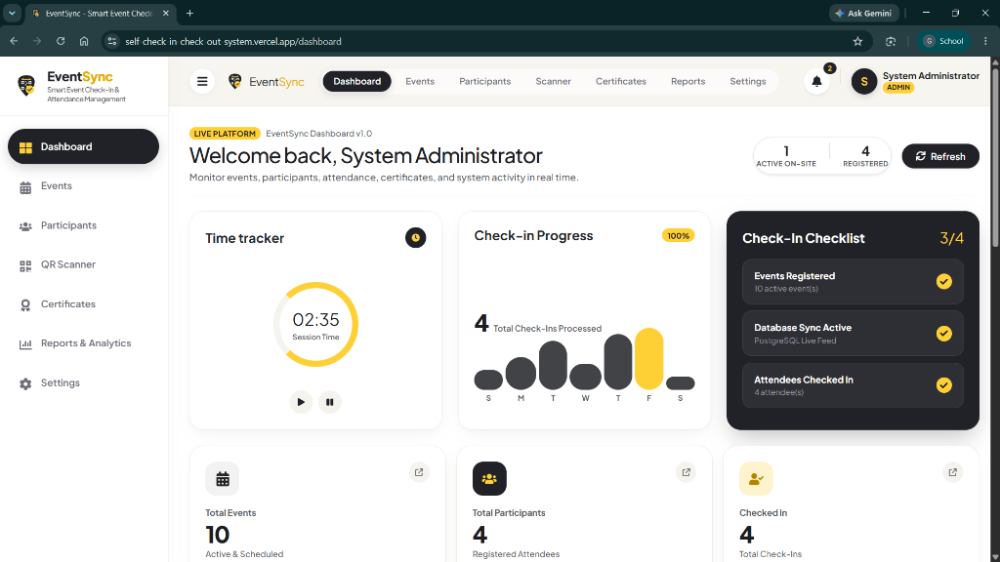
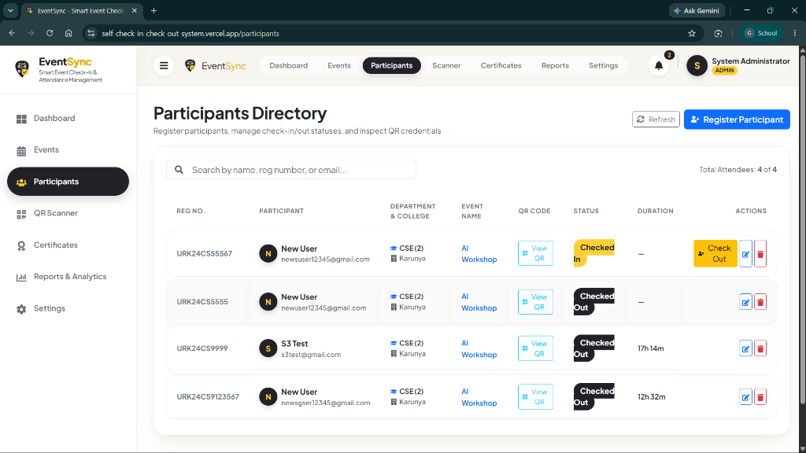
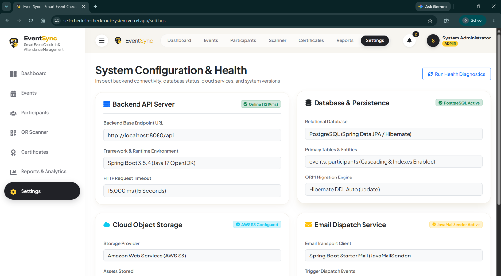
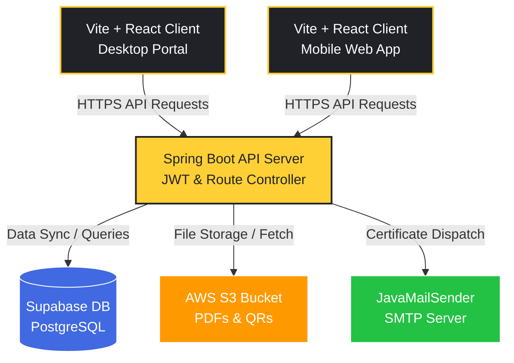
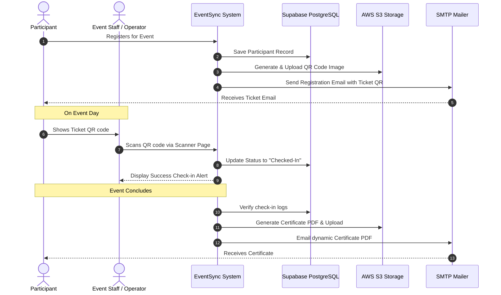

<div align="center">


<br/>

[](https://react.dev/)
[](https://spring.io/projects/spring-boot)
[](https://supabase.com/)
[](https://aws.amazon.com/s3/)
[](https://jwt.io/)
[](LICENSE)

<br/>

> **EventSync** is an enterprise-grade self check-in and check-out management system. Designed to handle event check-ins seamlessly, it reads participant registrations, validates attendance status via QR codes, and automatically generates and delivers verified participation certificates.

<br/>


</div>

---

## 📌 Overview

This project presents a **Self Check-in & Check-out Attendance Management Platform** comprised of a React client application and a Java Spring Boot REST API backend. It manages events and participants, generates secure QR credentials, reads scan check-ins, tracks real-time on-site metrics, and prints authenticated PDF certificates directly to participant mailboxes.

The platform provides role-based features:

| Role | Permissions & Access |
|:---:|---|
| 👑 **System Admin** | Full access to create/edit events, delete records, view reports, and modify global settings |
| 🛡️ **Staff / Operator** | Operations-focused access to scan QR codes, register participants, and verify check-ins |

---

## 🎯 Key Features

| # | Feature | Description |
|---|---|---|
| 1 | 📊 Bento Dashboard | Modern administrative viewport displaying real-time metrics, active attendees, and timelines |
| 2 | 📅 Event Lifecycle | Fully managed creation, editing, scheduling, and deletion controls for events |
| 3 | 👥 Participant Register | Directory containing profiles, ticket assignments, check-in history, and metadata |
| 4 | 🔍 Real-time QR Scanner | Camera scanner component to dynamically record check-in/check-out events |
| 5 | 🏅 Automated Certificates | Instant background creation of attendance certificates uploaded to AWS S3 and emailed to users |
| 6 | 📈 Analytics & Reports | Interactive graphical metrics mapping session timelines, check-in spikes, and volume distributions |
| 7 | 🔐 Role Security | JWT token-based authentication pathing dashboard control by administrative role levels |

---

## 🖼️ Project Showcase

### 🖥️ Desktop Web Interface

<table>
  <tr>
    <th align="center">📊 Bento Dashboard</th>
    <th align="center">👥 Participants Directory</th>
  </tr>
  <tr>
    <td align="center"></td>
    <td align="center"></td>
  </tr>
  <tr>
    <th align="center" colspan="2">⚙️ System Configuration & Health</th>
  </tr>
  <tr>
    <td align="center" colspan="2"></td>
  </tr>
</table>

### 📱 Responsive Mobile View

<div align="center">
  
</div>

---

## 📐 System Diagrams

### 🏗️ High-Level System Architecture



### 🔀 Event Lifecycle & Ticket Validation Flowchart



---

## 🔌 Tech Stack & Components

### 🖥️ Frontend Architecture
* **React 19 (Vite)**: Ultra-fast UI bundle rendering framework
* **React Router Dom (v7)**: Client-side routing management
* **Bootstrap 5**: Responsive layout grids and utility structures
* **ChartJS**: Real-time graphs, metrics, and trends rendering
* **SweetAlert2**: Micro-interaction modals, verification pop-ups, and alerts

### ⚙️ Backend Architecture
* **Spring Boot 3**: Core REST API architecture framework
* **PostgreSQL (Supabase)**: Relational database holding records, events, and audit logs
* **AWS S3**: Cloud repository hosting generated QR codes and PDFs
* **Spring Security + JWT**: Stateless token exchange authentication
* **Spring Mail**: SMTP mail transporter handling automated certificates dispatch

---

## 📊 Database Schema & Key Endpoints

### Data Model Relations
* **Users / Admins**: Administrative login credentials, roles, and profiles.
* **Events**: Event names, locations, dates, limits, and active status.
* **Participants**: Name, email, registration status, associated event, check-in, and check-out timestamps.

### Principal API Endpoints

| Method | Endpoint | Description | Role Level |
|---|---|---|---|
| `POST` | `/api/auth/login` | Exchanges login credentials for a valid JWT token | Public |
| `GET` | `/api/events` | Fetches list of active and archived events | Staff / Admin |
| `POST` | `/api/events` | Creates a new event record | Admin |
| `GET` | `/api/participants` | Returns registry of all event attendees | Staff / Admin |
| `POST` | `/api/scanner/check-in` | Validates QR code payload and records check-in time | Staff / Admin |
| `POST` | `/api/certificates/generate` | Builds certificate PDF, uploads to S3, and sends email | Staff / Admin |

---

## 🚀 Getting Started

### Step 1 — Database Import
1. Set up a PostgreSQL instance (or use Supabase).
2. Restore the database database schema:
   ```bash
   psql -U your_username -d your_database -f backup.sql
   ```

### Step 2 — Configure Environment Properties
1. Navigate to the backend directory:
   ```bash
   cd self-checkin-system
   ```
2. Copy `.env.example` to `.env` and enter your credentials:
   ```env
   SPRING_DATASOURCE_URL=jdbc:postgresql://your-db-host:5432/your-db
   SPRING_DATASOURCE_USERNAME=your_db_user
   SPRING_DATASOURCE_PASSWORD=your_db_password
   AWS_ACCESS_KEY=your_aws_key
   AWS_SECRET_KEY=your_aws_secret
   AWS_BUCKET_NAME=your_s3_bucket
   SPRING_MAIL_USERNAME=your_sender_email
   SPRING_MAIL_PASSWORD=your_email_app_password
   JWT_SECRET=your_jwt_signing_key
   ```
3. Boot up the server:
   ```bash
   mvnw spring-boot:run
   ```

### Step 3 — Install & Run Client Dashboard
1. Move to the frontend directory:
   ```bash
   cd self-checkin-frontend
   ```
2. Run standard installation:
   ```bash
   npm install
   ```
3. Start the dev client:
   ```bash
   npm run dev
   ```
4. Access the web app in your browser at `http://localhost:5173`.

---

## 📁 Repository Structure

```
Self-Check-in-Check-out-System/
│
├── self-checkin-frontend/       # React SPA Client
│   ├── src/
│   │   ├── components/          # Layout structure (Navbar, Sidebar)
│   │   ├── pages/               # Functional pages (Dashboard, Scanner, Events)
│   │   └── css/                 # Custom styling theme definitions
│   └── package.json             # JS Dependencies
│
├── self-checkin-system/         # Java Spring Boot API Server
│   ├── src/main/java/           # Source code logic controllers & services
│   ├── src/main/resources/      # DB credentials & application properties
│   └── pom.xml                  # Maven config
│
├── screenshots/                 # UI assets and screenshots
├── backup.sql                   # Database backup schema
└── README.md                    # Project documentation (this file)
```

---

## 🌍 Real-world Applications

* 🏢 **Corporate Seminars** — Track guest attendance volume and print certificates.
* 🎓 **Academic Conferences** — Automated student/researcher check-in and session logging.
* 🎫 **Concerts & Conventions** — Quick ticket verification and capacity limits monitoring.
* 🏨 **Exhibition & Trade Shows** — Real-time analytics of active guest volumes.

---

## 📜 License

This project is licensed under the **MIT License** — see the [LICENSE](LICENSE) file for full details.

---

<div align="center">

**⭐ Star this repo if you found it useful! ⭐**

<br/>


<br/>

*Made with ❤️ by gautham75*

</div>
