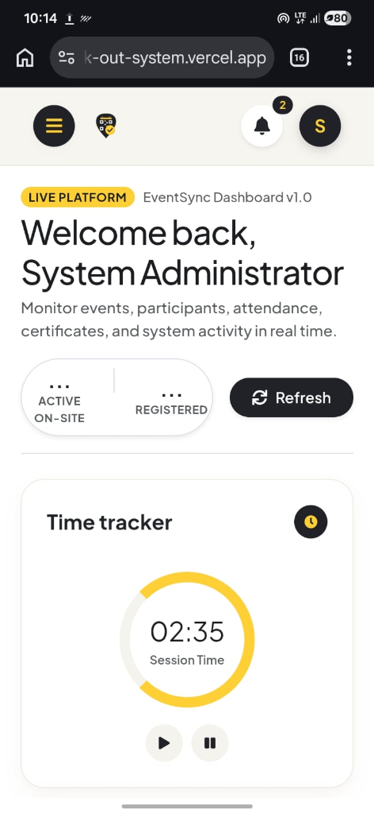

# EventSync - Self Check-in & Check-out System

EventSync is a modern, premium web application designed to streamline event attendance, check-in/check-out tracking, and automatic certificate generation. Built with a robust Spring Boot backend and an elegant React-based dashboard, EventSync provides real-time analytics and management for administrators and staff.

## 📱 Mobile-Responsive Interface

Here is a preview of the EventSync dashboard layout optimized for mobile screens:

<p align="center">
  
</p>

---

## 🚀 Key Features

* **Event Management**: Create, update, and manage multiple events in real time.
* **Participant Tracking**: Keep records of registered participants and view their check-in/check-out status.
* **Fast QR Scanner**: Scan participant QR codes to instantly record check-in and check-out timestamps.
* **Automated Certificate Generation**: Generate and send dynamic participation certificates using PDF templates.
* **Real-time Reports**: Interactive charts and session metrics powered by Chart.js.
* **Modern Bento-Grid UI**: Aesthetic, responsive dashboard matching modern design guidelines.

---

## 🛠️ Tech Stack

### Frontend
* **Core**: React 19 (Vite), React Router v7
* **Styling**: Bootstrap 5 + Vanilla CSS (custom design theme)
* **Visualization**: Chart.js & React-Chartjs-2
* **Notifications**: SweetAlert2

### Backend
* **Core**: Java & Spring Boot 3
* **Security**: JWT & Spring Security
* **Database**: PostgreSQL (hosted via Supabase)
* **Cloud Storage**: AWS S3 (for certificates and QR codes)
* **Mailing**: SMTP Mail Sender

---

## 📦 Project Structure

```text
├── self-checkin-frontend/    # React SPA dashboard client
├── self-checkin-system/      # Spring Boot REST API server
├── screenshots/              # UI mockups and screenshot media
└── backup.sql                # Database schema/data backup
```

---

## ⚙️ Local Setup Instructions

### 1. Database Setup
* Ensure PostgreSQL is running.
* Import the `backup.sql` file in the root directory to set up the default tables and schemas:
  ```bash
  psql -U your_username -d your_database -f backup.sql
  ```

### 2. Backend Server Configuration
1. Navigate to the backend directory:
   ```bash
   cd self-checkin-system
   ```
2. Create or copy the `.env.example` file to `.env` and fill in your credentials:
   ```env
   SPRING_DATASOURCE_URL=jdbc:postgresql://your-db-host:5432/your-db-name
   SPRING_DATASOURCE_USERNAME=your_username
   SPRING_DATASOURCE_PASSWORD=your_password
   AWS_ACCESS_KEY=your_aws_key
   AWS_SECRET_KEY=your_aws_secret
   AWS_BUCKET_NAME=your_s3_bucket_name
   SPRING_MAIL_USERNAME=your_email
   SPRING_MAIL_PASSWORD=your_email_app_password
   JWT_SECRET=your_jwt_signing_key
   ```
3. Run the Spring Boot application:
   ```bash
   mvnw spring-boot:run
   ```

### 3. Frontend Client Configuration
1. Navigate to the frontend directory:
   ```bash
   cd self-checkin-frontend
   ```
2. Install npm dependencies:
   ```bash
   npm install
   ```
3. Run the Vite development server:
   ```bash
   npm run dev
   ```
4. Access the frontend locally at `http://localhost:5173`.
